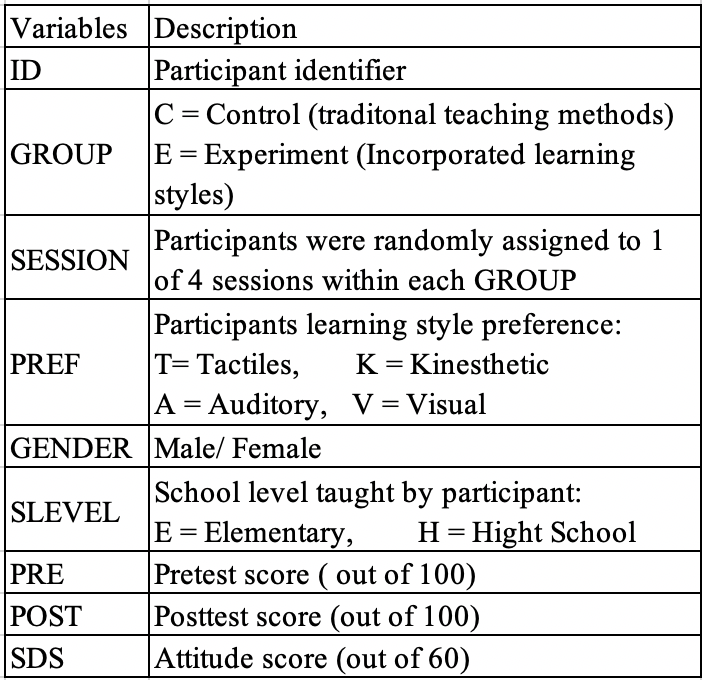
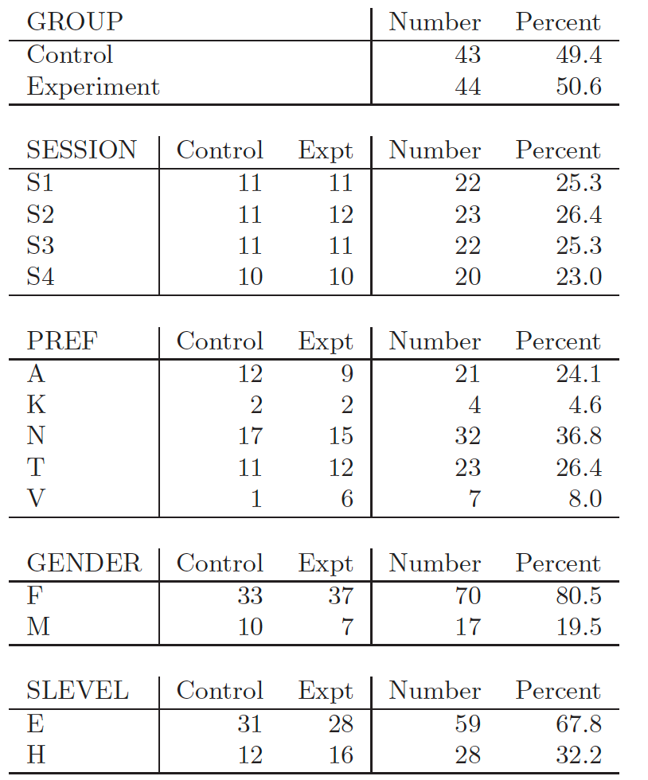
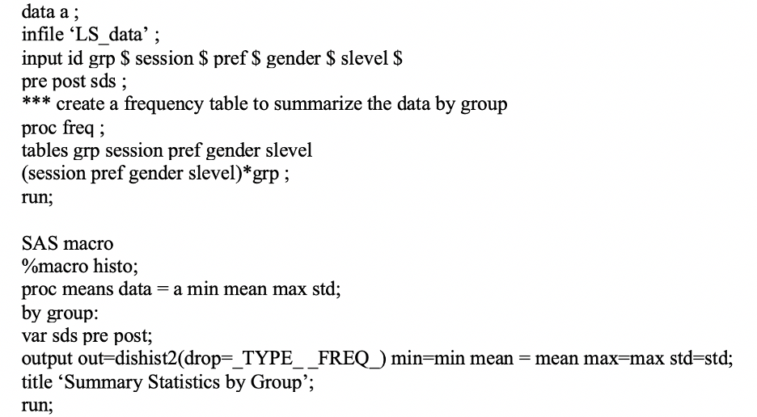
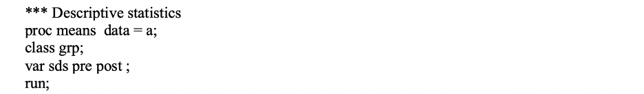
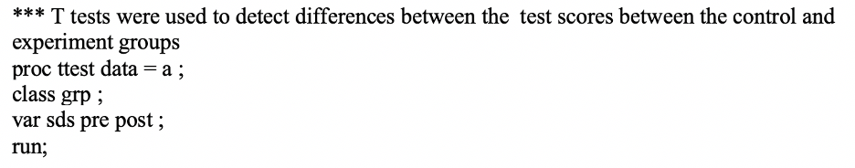
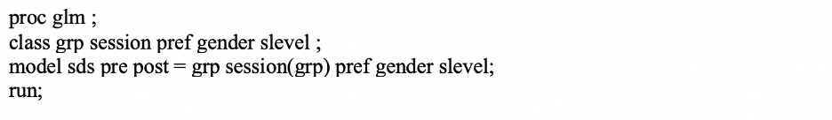
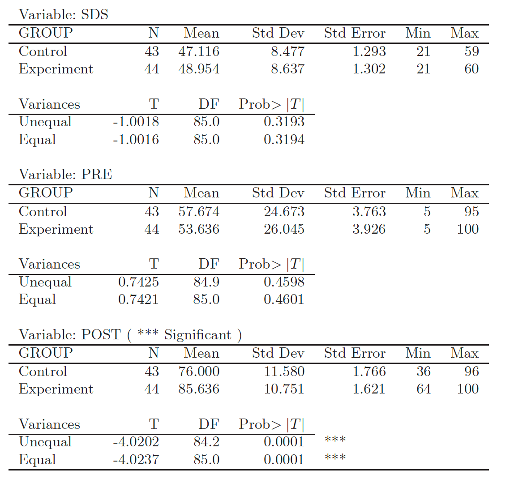
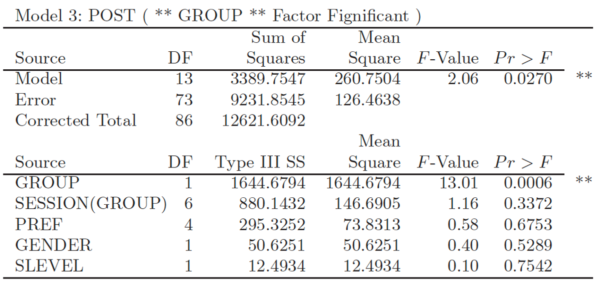

## Learning-style-preference-analysis
### Objective:
The aim of this study was to investigate whether instruction based on a person’s learning-style preferences would improve retention of the material taught
### 1.1 Study desgin and Data: 
The participants consisted of high school and elementary school teachers who were randomly allocated into two groups: Control and Experiment. The traditional instruction format was used for the Control group. For the Experiment group, traditional instruction was augmented by activities specifically suited to the preferred learning styles of the participants. Both groups were split into four sessions and each session received the same instruction formats.
### 1.2 Data dictionary and variables:

### 2. Methodology:
#### 2.1) Explorary Data Analysis : 
Summary statistics for all the variables in the database, overall and by group. 
Frequency table, bar charts, and histograms effectively display the distribution of the variables

#### 2.2) T-test: 
To assess whether a significant difference exists between the means associated with two independent sample (average POST score of Experiment vs. Control Groups)

#### 2.3) MANOVA: 
To test whether any of several pertinent  factors had an effect upon POST.

POST = GROUP + SESSION(GROUP) + PREF + GENDER + SLEVE

### Notes:
data a; Reads 9 columns of data from the file "LS_data"
proc freq; Generates frequency tables (4 two-way tables all versus grp)
proc means; Computes means, variances, etc. for quantitative variables
proc ttest; Performs t-tests of SDS, PRE, and POST by GROUP
proc glm; Fits ANOVA models for SDS, PRE, and POST.

### 3. Results:

T tests were used to detect differences between the average test scores between the control and experiment groups, to assess whether a significant different exist between the means associated with two independent samples (average POST scores of the Experiment vs. Control Groups). Significance is based on the P-value associated with the t-test. By convention,
A p-value < 0.05 (5%) is considered to provide sufficient evidence of a significant differentness. If p-value less than 1% would suggest strong evidence of a statistically significant result.

It was found that there is no significant difference between the Experiment and Control groups when SDS and PRE are considered
(P-value > 0.05). This suggests that there was no meaningful difference between the Control group and the Experiment group as far as prior knowledge and attitude in concerned. However, POST is strongly significant which suggests that the means of the two groups are significantly different as far as knowledge retained is concerned.

The overall significance of the model is first used to determine whether any of the factors had a significant effect on the response. To determine the effect of an individual factor, the Type III sums of squares (SS) is used.
POST is the response variable, and GROUP, SESSION(GROUP), PREF, GENDER, and SLEVEL are all factors that could potentially affect the response. Only GROUP was found to be significant with a P-value of 0.0006, Group is the only factor would effect the post score. 
